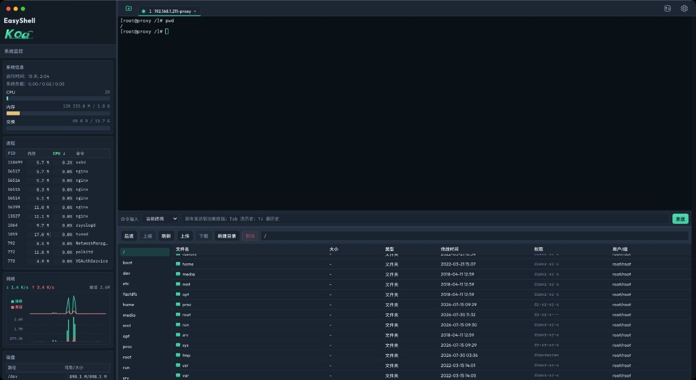

# EasyShell

轻量 **SSH / SFTP / Windows 远程桌面** 客户端（界面风格接近 FinalShell）

<p align="center">
  <a href="https://github.com/tiandi0716/EasyShell/releases/latest"></a>
  <a href="https://github.com/tiandi0716/EasyShell/releases"></a>
</p>

<p align="center">
  
</p>

## 功能特性

- 主机连接管理（SSH 密码/私钥库、Windows RDP）
- 多标签 SSH 终端（xterm.js）与内嵌 Windows 远程桌面
- SFTP 文件浏览、上传、下载（SSH；可拖入本地文件上传）
- 系统监控：SSH 采集 CPU/内存/进程等；RDP 展示会话与画面传输状态
- 系统代理自动识别（Clash 等），方便访问内网
- 连接导入导出（可按目录导出）、FinalShell 配置转换
- 本地加密保存连接配置（无激活、无账号绑定）

渲染进程 API 类型定义见：`src/vite-env.d.ts`

## 下载安装

请到 [Releases](https://github.com/tiandi0716/EasyShell/releases/latest) 下载对应平台安装包：

| 平台 | 文件 |
|------|------|
| macOS Apple Silicon | `EasyShell-*-arm64.dmg` |
| macOS Intel | `EasyShell-*.dmg` |
| Windows 安装包 | `EasyShell Setup *.exe` |
| Windows 绿色版 | `EasyShell *.exe` |

### macOS

1. 打开 dmg，把 **EasyShell** 拖到「应用程序」
2. 首次打开若提示「无法验证开发者」：
   - 系统设置 → 隐私与安全性 → 仍要打开  
   - 或终端执行：`xattr -cr /Applications/EasyShell.app`

### Windows

1. 使用 `EasyShell Setup *.exe` 按向导安装  
2. 或直接运行绿色版 `EasyShell *.exe`

## 开发启动

```bash
cd easyshell
npm install
npm run dev
```

开发态 Dock 可能仍显示 Electron 默认图标/名称，属正常现象；正式包使用 `build/icon.*`。  
连接配置与正式包共用同一数据目录（见下方「连接配置位置」）。

## 自行打包

先打包，产物在 `release/` 目录：

```bash
npm install

# 只打 macOS（当前这台 Mac 上推荐）
npm run dist:mac

# 只打 Windows（可在 Mac 上交叉打包）
npm run dist:win

# mac + win 一起打
npm run dist:all
```

打包脚本默认走 **npmmirror 国内镜像**（`.npmrc` + `scripts/run-builder.cjs`），避免从 GitHub 拉 Electron / winCodeSign 过慢。若要用官方源，可临时覆盖：

```bash
ELECTRON_MIRROR=https://github.com/electron/electron/releases/download/ \
ELECTRON_BUILDER_BINARIES_MIRROR=https://github.com/electron-userland/electron-builder-binaries/releases/download/ \
npm run dist:win
```

应用图标资源：

| 文件 | 用途 |
|------|------|
| `build/icon.png` | 通用 / Windows |
| `build/icon.icns` | macOS |
| `public/icon.png` | 页面 favicon |

> 说明：在 macOS 上可以打 Windows 包；在 Windows 上一般打不了 macOS 包。正式发版建议分别在对应系统上打包更稳妥。

## 本地不打包直接跑

```bash
npm run build
npm start
```

## 使用说明

1. 左侧「新建目录 / 新建连接」管理主机；辅助功能可管理私钥
2. 双击连接：
   - **SSH**：打开终端标签 + 右侧文件管理 + 系统监控
   - **Windows**：应用内嵌远程桌面标签（自动填入已保存密码），左侧显示 RDP 会话信息
3. SSH 连接后可在文件面板浏览/上传/下载

连接配置位置（开发 / 正式包相同）：

- macOS：`~/Library/Application Support/easyshell/`
- Windows：`%APPDATA%/easyshell/`

主要文件：`connections.json`、`folders.json`、`private-keys.json`、`settings.json`

## 安全说明（摘要）

| 项 | 做法 |
|----|------|
| 本地密码 / 私钥 | 使用系统 `safeStorage` 封装后写入磁盘，避免明文 |
| 导入导出 | 密码字段仍用 CryptoJS AES（与之前相同） |
| 密钥材料 | 源码中异或混淆存放，避免明文常量 |
| 安装包 | 不打包示例主机配置目录 |
| 页面 | 禁止任意外链导航 / 弹窗 |

> 桌面软件无法做到“绝对防逆向”。本项目重点是：**磁盘不明文、导出难直接肉眼破解、减小误分发风险**。

## 技术栈

- Electron
- React + TypeScript + Vite
- ssh2 / socks / @electerm/rdpjs
- xterm.js
- electron-builder（安装包）
